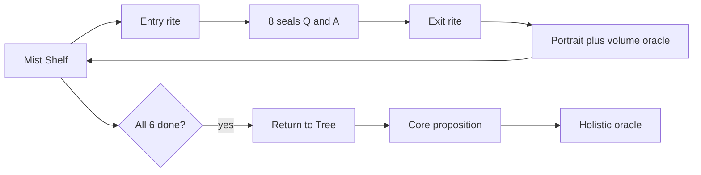

# 雾岸六卷

心象生命之树探索 · *Mist Shore · Six Books* · 霧岸六巻

文档以**简体、English、日本語**并列写就；下面各节按需出现，不必每段都三语重复。

---

## 目录

| | |
|---|---|
| [一、理论栈](#一理论栈) | 十篇正文 + 附录，建议先读 |
| [二、核心命题](#二核心命题) | 雾岸在说什么 |
| [三、这是什么](#三这是什么) | Demo 概览 |
| [四、体验路径](#四体验路径) | 从书架到整象 |
| [五、修持环](#五修持环) | 入卷 / 离卷 / 归树；[引导语全文](docs/volume-rite-copy.md) |
| [六、界面预览](#六界面预览) | 书架截图 |
| [七、开发与运维](#七开发与运维) | 安装、脚本、约定 |

长文理论在 [`docs/theory/`](docs/theory/)。改代码看 [SKILL.md](.cursor/skills/psyche-tree-demo/SKILL.md)。修持文案源：`src/i18n/volumeRite.ts`，导出 MD：`npm run generate:rite-docs`。

---

## 一、理论栈

按顺序读 [`docs/theory/`](docs/theory/) **01 → 10**，再读 [附录：现代对应](docs/theory/appendix-现代对应.md)。每篇只问一个问题；符号与旧五层稿在附录与 [archive/](docs/theory/archive/)。

| 篇 | 文档 | 问题 |
|----|------|------|
| 1 | [01-雾岸世界.md](docs/theory/01-雾岸世界.md) | 我来到哪里？ |
| 2 | [02-照见论.md](docs/theory/02-照见论.md) | 为什么会照见自己？ |
| 3 | [03-各人之雾.md](docs/theory/03-各人之雾.md) | 为何每人雾不同？ |
| 4–10 | [目录](docs/theory/README.md) | 生长、缘、心流、万象、观、命、整象 |

问印 `theoryLayer.ts` 仍是题面化；**正文不以 State/Field 开头**。索引：[docs/theory/README.md](docs/theory/README.md)

---

## 二、核心命题

**主**  
人的一生，不是在寻找答案，而是在不断**校准**自己看见世界、感受世界、与世界相处的方式。

*A life is not a search for answers, but a continual calibration of how you see, feel, and meet the world.*  
*人生は答えを探す旅ではなく、世界の見方・感じ方・向き合い方を調え続ける旅である。*

**副**  
世界未必因你而改变，但你**如何看见**，会不断改变你自己。

*The world may not change because of you—but how you see keeps changing you.*  
*世界はあなたのために変わらなくても、見方はあなた自身を変え続ける。*

---

大多数测评默认「答完 → 打分 → 给结论」。雾岸把顺序倒过来：先校准「看见」，再谈映像。六卷像六面镜，整象是六卷都走过、归树之后的一次开口——不是标准答案库。上面五层理论是机制怎么写；这两句是为什么做。

---

## 三、这是什么

一个网页 Demo：六卷翻书问答（心象 / 映心 / 明思 / 缘书 / 流衡 / 向光），背景是一棵随进度亮起的生命之树。每卷结束有心象画像和单卷神谕；六卷都完成后，回书架走**归树**，才出现整象神谕。

界面四语：简体、繁體（OpenCC）、English、日本語。繁体 UI 由简体转，神谕各语言单独生成、单独缓存。

*Flip-book self-exploration, Tree of Life background, per-volume oracle, holistic oracle after Return to the Tree. Four locales.*  
*六巻の問答、生命の樹、巻別神託、帰樹後の整象。四言語。*

---

## 四、体验路径



| 节点 | 做什么 |
|------|--------|
| 书架 | 选卷、留邮箱、看树；六卷齐后出现整象入口 |
| 入卷 | 全屏引导，见 [五、修持环](#五修持环) |
| 问印 | 8 页：6 维 + 注意力 + 整象封印；一页一卡，约 420ms 翻页，无分数 |
| 离卷 | 合卷前短仪式；心象卷可写一句 |
| 单卷结果 | 画像 → 神谕 → 合书 → 回书架（**整象不在单卷里**） |
| 归树 | 首次开整象前必过；树没变，看树的人变了 |
| 整象 | 书架 overlay，不是六份报告的拼接 |

视觉：深黑底、黑白意象卡、淡金点缀；各语言用各自的 mystic 字体。

---

## 五、修持环

每卷固定三步：**入卷 → 问印 → 离卷**。六卷顺序随意。齐了之后：**归树 → 核心命题 → 整象神谕**。

为什么要这套仪式——

- **入卷**：让人慢下来。看见比作答先发生。
- **离卷**：结果出来前留一点空；心象卷可以写一句。
- **归树**：六卷容易变成六块「结论」；归树把散开的视线收回到同一棵树，再开整象。

| 卷 | 意象 | 测什么 |
|----|------|--------|
| 心象 | 湖 | 自我；可写「今天看见了什么」 |
| 映心 | 落叶顺河 | 情感；不必全命名 |
| 明思 | 夜空、北极星 | 思维；最后一念自熄 |
| 缘书 | 丝线 | 关系；不断、不拉 |
| 流衡 | 船心 | 节奏、守衡 |
| 向光 | 远方微光 | 方向；今天一小步 |

代码：`VolumeRiteOverlay`、`ReturnToTreeOverlay`，文案 [`volumeRite.ts`](src/i18n/volumeRite.ts)。

### 引导语全文

[`docs/volume-rite-copy.md`](docs/volume-rite-copy.md)（简体 / English / 日本語，与产品同源）

心象 · 入卷开头示例：

> 阅读前，请安静坐三分钟。不要回忆今天发生了什么。……  
> *Before reading, sit quietly for three minutes. Do not replay what happened today.……*  
> *読む前に、三分間静かに座れ。今日起きたことを振り返るな。……*

---

## 六、界面预览

截图在 [`docs/screenshots/homepage/`](docs/screenshots/homepage/)。本地 dev 跑着时可执行：

```bash
node scripts/capture-homepage-screenshots.mjs
```

| | |
|---|---|
| 简体 |  |
| 繁體 |  |
| English |  |
| 日本語 |  |

---

## 七、开发与运维

### 跑起来

```bash
git clone git@github.com:huter927419-sys/psyche-tree-demo.git
cd psyche-tree-demo
npm install
cp .env.example .env.local   # 填 DEEPSEEK_API_KEY
npm run dev                  # http://localhost:5173
```

```env
DEEPSEEK_API_KEY=your_api_key_here
DEEPSEEK_MODEL=deepseek-v4-pro
SQLITE_PATH=./data/psyche-tree.sqlite
PSYCHE_READING_TEST_FALLBACK=0   # 仅 QA；生产务必 0
```

Key 只在 Vite 中间件用，不进前端包。`npm run build` 出 `dist/` + Node API。

### 常用脚本

| 命令 | 用途 |
|------|------|
| `node scripts/verify-full-flow.mjs` | API 冒烟（39 项） |
| `node scripts/verify-rite-flow.mjs` | Playwright 修持环 |
| `npm run generate:rite-docs` | 从 volumeRite.ts 生成修持 MD |
| `node scripts/complete-user-journey.mjs` | 补全六卷 |
| `node scripts/test-locale-switch.mjs` | 四语神谕缓存 |
| `node scripts/reset-db.mjs` | 清空 SQLite |

### 别踩的线

1. 一页一卡，~420ms，没有分数。
2. 整象只在书架出现。
3. 树进度只计维度 1–6。
4. 换语言读缓存，不重复调模型（除非缺该语言）。
5. 生产不要开 `PSYCHE_READING_TEST_FALLBACK`。

### 语言与库

| Code | 说明 | 神谕列 |
|------|------|--------|
| `zh` | 简体 | `*_zh`, `holistic_reading_zh` |
| `zhTw` | 繁体 UI（OpenCC）；神谕独立生成 | `*_zh_tw` |
| `en` | 英文 | `*_en` |
| `ja` | 日文 | `*_ja` |

### 结构

```
psyche-tree-demo/
├── README.md
├── docs/theory/              # 01–10 + appendix + archive
├── docs/volume-rite-copy.md  # 修持文案
├── docs/screenshots/
├── .cursor/skills/…/SKILL.md
└── src/i18n/volumeRite.ts
```

React 19 · Vite 8 · TypeScript · Tailwind 4 · SQLite · DeepSeek · Playwright

---

*雾岸六卷 — 校准看见，而不是索取标准答案。*
