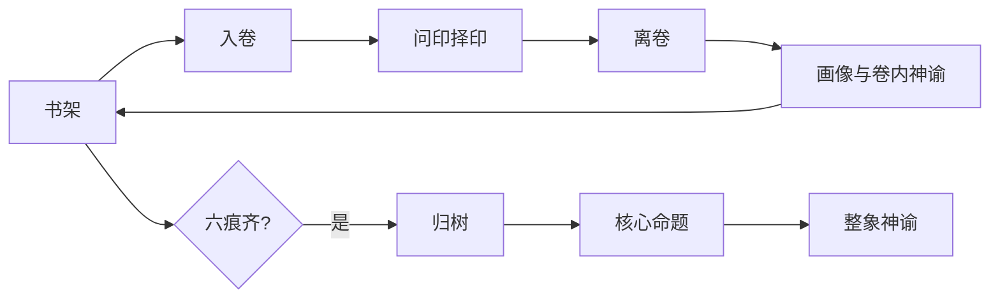
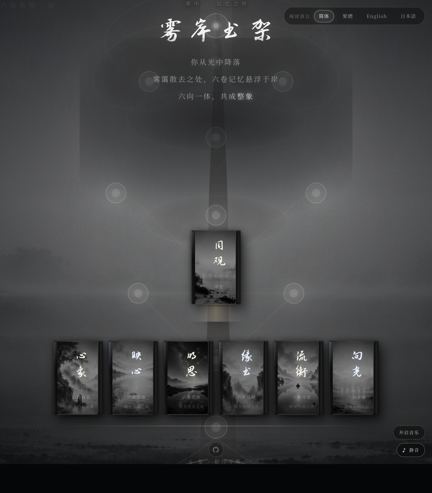
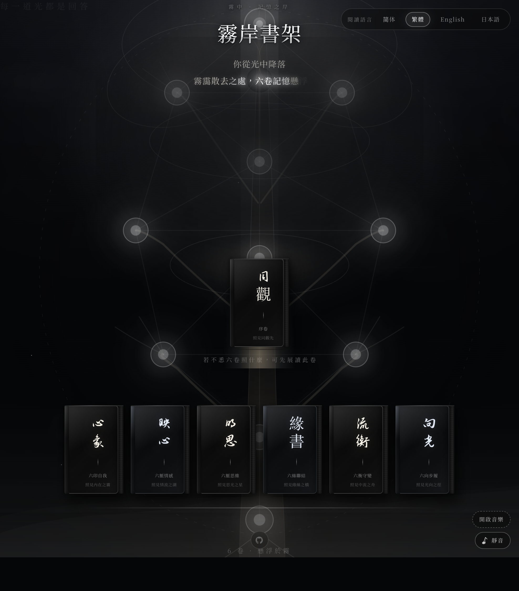
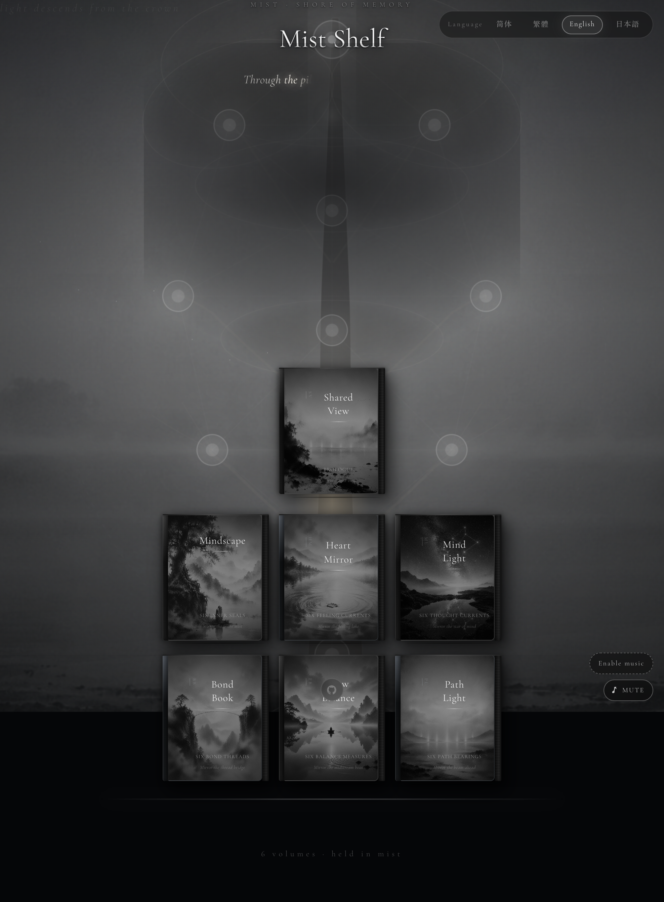
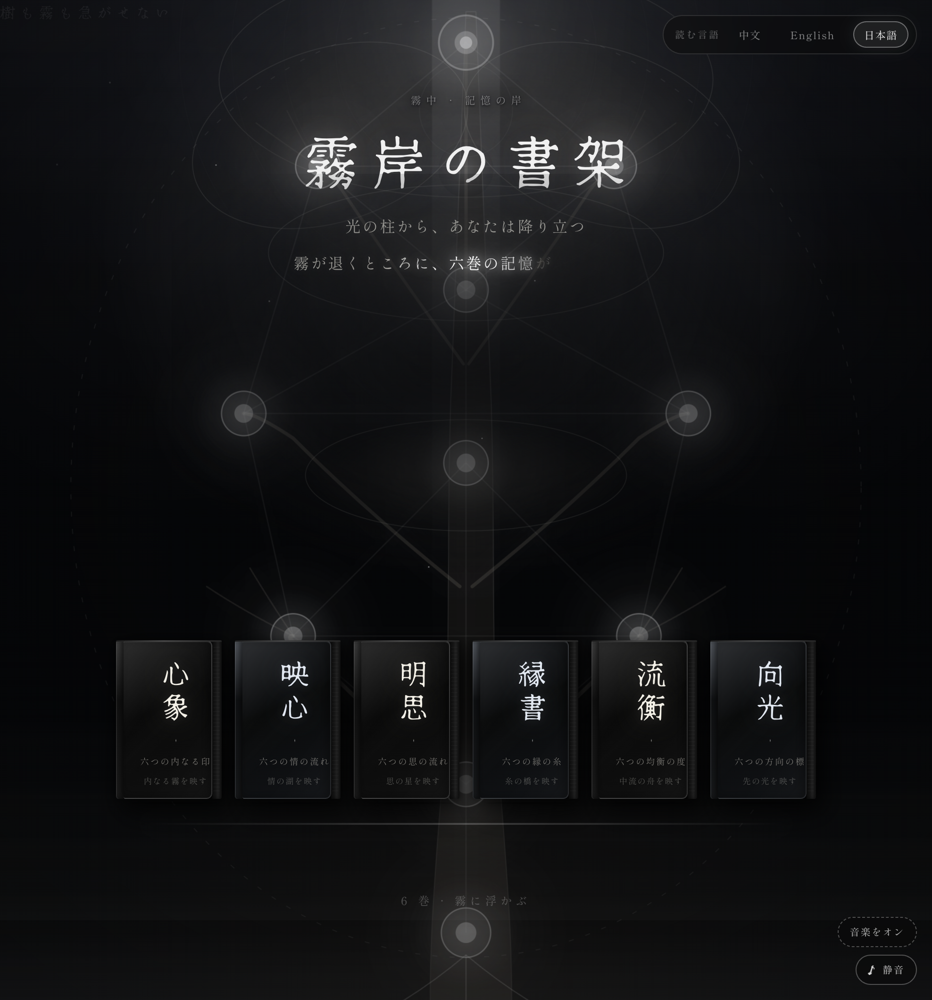

# 雾岸六卷

心象生命之树探索 · *Mist Shore · Six Books* · 霧岸六巻

**一套关于生命状态的实践体系**——不是宗教，不是心理测试；在变化里 **重新照见自己**，而非贴型打分。

本仓库含 **网页 Demo**（六卷翻书留痕、生命之树）与 **完整理论文档**。若你第一次接触雾岸，请先读序文；若你要改代码，见 [八、开发与运维](#八开发与运维)。

| | |
|---|---|
| **📖 序 · 对外说明（推荐先读）** | [**《为什么会有〈雾岸六卷〉》**](docs/为什么会有雾岸六卷.md) |
| 副标题 | 一次关于心理学、东方思想与现代认知的交叉讨论 |
| 形式 | 七章序文 + 《诸家互照》附录（非论文） |
| 现行发布 | GitHub `docs/`（**官网版待上线**，内容与序文同源） |

序文回答：雾岸在问什么 · 定位（非教门） · 东方／心理学／世界观研究 **交映** · 留痕与常模 · 为何六卷 · 一次读卷之后 · 写给未来的读者。

---

## 目录

| | |
|---|---|
| [**先读 · 为什么会有〈雾岸六卷〉**](docs/为什么会有雾岸六卷.md) | 对外说明 · 非宗教非测评 · 诸家互照 |
| [一、这是什么](#一这是什么) | Demo 概览 · 与常见测评之分 |
| [二、核心命题](#二核心命题) | 雾岸在说什么 |
| [三、理论栈](#三理论栈) | 世界观六篇 + 实践八章 + 附录 |
| [四、一次同旅](#四一次同旅) | 书架 → 六卷 → 归树 → 整象 |
| [五、修持环](#五修持环) | 入卷 / 离卷 / 归树；[引导语全文](docs/volume-rite-copy.md) |
| [六、改体验前 · 四问](#六改体验前-四问) | 动流程前先对照实践篇 |
| [七、界面预览](#七界面预览) | 书架截图 |
| [八、开发与运维](#八开发与运维) | 安装、脚本、约定 |

长文：**[为什么会有〈雾岸六卷〉](docs/为什么会有雾岸六卷.md)** · [理论栈索引](docs/theory/README.md) · [实践篇索引](docs/theory/implement/README.md) · 改代码：[SKILL.md](.cursor/skills/psyche-tree-demo/SKILL.md)  
修持文案源：`src/i18n/volumeRite.ts` · 导出 MD：`npm run generate:rite-docs`

---

## 先读 · 《为什么会有〈雾岸六卷〉》

**[→ 打开全文](docs/为什么会有雾岸六卷.md)**

雾岸 **没有** 教义、神祇、修行等级或唯一答案。它问的是：

> **人在每一次变化里，如何重新照见自己。**

序文用七章说明定位（不作学术论文）：

| 章 | 在说什么 |
|----|----------|
| 一 | 雾岸在问什么；与他路 **各答其问**，并列不取代 |
| 二 | **非教门**——观察自己、接缘、变化 |
| 三 | **交映**：周易／庄子／大学 … 与 meaning making、worldview、phenomenology 并置同席 |
| 四 | **留痕与常模**；无分数无类型；留痕、归树、整象的读态逻辑 |
| 五 | 六卷是 **六种观察法**，非六种人格 |
| 六 | 一次读卷之后；不承诺结果，守住息间与照见 |
| 七 | 未来可变；愿留「变化里仍愿照见」 |
| 附录 | **[诸家互照](docs/为什么会有雾岸六卷.md#附录--诸家互照)** — 雾岸 · 东方 · 现代研究并列，不互证强弱 |

读完序文再读 [理论栈](#三理论栈) 或直接 [跑 Demo](#跑起来)。更细的学术并读见 [Taves (2018) 交叉读](docs/theory/cross/Taves2018-雾岸交叉读.md)。

---

## 一、这是什么

**雾岸**采用「先校准如何看见，再留此息之象」的体验路径（详见 [序文 · 第四章](docs/为什么会有雾岸六卷.md#第四章--留痕与常模)）：

- **六卷**（心象 / 映心 / 明思 / 缘书 / 流衡 / 向光）——同一棵树上的六束光，顺序任意。
- **问印**——一页一择、无分数；留的是**此息之应**，不是 IQ 测验。
- **单卷**——画像 + 卷内神谕；**整象**只在六痕齐、**归树**之后于书架开口，非六份报告拼接。
- **四语界面**：简体、繁體（OpenCC）、English、日本語；神谕各语言独立生成与缓存。

*Six flip-books, Tree of Life, per-volume oracle, holistic oracle after Return to the Tree—calibration, not typing.*

**文档分工**

| 读什么 | 去哪 |
|--------|------|
| **为何有雾岸、非宗教非测评** | [**为什么会有〈雾岸六卷〉**](docs/为什么会有雾岸六卷.md) |
| 世界为何如此（变·见·行·答·连·向） | [01–06 世界观](docs/theory/01-本源.md) |
| 体验应如何践行（态·觉·续·接·应·生·向·整） | [实践篇 01–08](docs/theory/implement/README.md) |
| 符号 U、工程对照 | [附录 · U](docs/theory/appendix-现代对应.md) |
| 引导语原文 | [volume-rite-copy.md](docs/volume-rite-copy.md) |

---

## 二、核心命题

**主**  
人的一生，不是在寻找答案，而是在不断**校准**自己看见世界、感受世界、与世界相处的方式。

*A life is not a search for answers, but a continual calibration of how you see, feel, and meet the world.*  
*人生は答えを探す旅ではなく、世界の見方・感じ方・向き合い方を調え続ける旅である。*

**副**  
世界未必因你而改变，但你**如何看见**，会不断改变你自己。

*The world may not change because of you—but how you see keeps changing you.*  
*世界はあなたのために変わらなくても、見方はあなた自身を変え続ける。*

归树前的**核心命题**与 [06 向光](docs/theory/06-向光.md)、[07 意义论 · 实践原则](docs/theory/implement/07-意义论.md) 同脉——聚光校准，非远处奖杯。

---

## 三、理论栈

```
附录 · U（可穿插）
    ↓
世界观 01 本源 → … → 06 向光     （六篇成环：变·见·行·答·连·往）
    ↓
实践篇 01 存在 → … → 08 整合       （八章同构：态·觉·续·接·应·生·向·整）
    ↓
本 Demo：六卷同旅 · 留痕 · 归树 · 整象
```

| 层 | 索引 | 何时读 |
|----|------|--------|
| **世界观** | [docs/theory/README.md](docs/theory/README.md) | 理解机制、写文案、对外讲述 |
| **实践篇** | [docs/theory/implement/README.md](docs/theory/implement/README.md) | **改流程、神谕、问印、归树前必读** |
| **附录** | [appendix-现代对应.md](docs/theory/appendix-现代对应.md) | U / Φ / A / F；[修持↔理论↔产品](docs/theory/appendix-现代对应.md#修持-理论-产品) |

**六篇 ↔ 八章（简）**

| 世界观 | 章眼 | 实践篇 | 章眼（践行） |
|--------|------|--------|--------------|
| [01 本源](docs/theory/01-本源.md) | 变→态→命→觉 | [01 存在论](docs/theory/implement/01-存在论.md) | 读态，不贴型 |
| [02 观照](docs/theory/02-观照.md) | 照见开叉于链 | [02 意识论](docs/theory/implement/02-意识论.md) | 先觉，再答 |
| [03 流动](docs/theory/03-流动.md) | 稳者变中归息 | [03 流动论](docs/theory/implement/03-流动论.md) | 一息可留，一生不可截 |
| [05 共生](docs/theory/05-共生.md) | 真连接仍各自应 | [04 关系论](docs/theory/implement/04-关系论.md) | 连接，而不占有 |
| [04 因应](docs/theory/04-因应.md) | 命是回应的编织 | [05 因应论](docs/theory/implement/05-因应论.md) | 留应，不留命 |
| （跨章） | 痕上生象 | [06 生成论](docs/theory/implement/06-生成论.md) | 鸣其已生，不造其未生 |
| [06 向光](docs/theory/06-向光.md) | 今息知所重、一步 | [07 意义论](docs/theory/implement/07-意义论.md) | 归树，不归终 |
| [附录 · U](docs/theory/appendix-现代对应.md) | 六脉并看 | [08 整合论](docs/theory/implement/08-整合论.md) | 见整体，而非见部分 |

实践篇每章七节：**实践问 → 理论根源 → 章眼 → 理论原则 → 实践原则（含仪轨链）→ 不可与可 → 实现映射 → 理论位置 → 本章收**。详见 [章体模板](docs/theory/implement/README.md#章体模板01-08-统一)。

---

## 四、一次同旅



| 节点 | 做什么 | 世界观 | 实践篇 |
|------|--------|--------|--------|
| 书架 | 选卷、留邮箱、看树亮痕；六齐后出现整象入口 | [01 本源](docs/theory/01-本源.md) · [附录 · U](docs/theory/appendix-现代对应.md) | [01 存在](docs/theory/implement/01-存在论.md) · [08 整合](docs/theory/implement/08-整合论.md) |
| 入卷 | 全屏引导，先停再答 | [02 观照](docs/theory/02-观照.md) | [02 意识](docs/theory/implement/02-意识论.md) |
| 问印 | 8 页：六维 + 注意力 + 卷内齐观印；一页一卡，无分数 | [04 因应](docs/theory/04-因应.md) | [05 因应](docs/theory/implement/05-因应论.md) · [08 整合](docs/theory/implement/08-整合论.md) |
| 离卷 | 合卷前短仪式；心象卷可写一句 | [02 观照](docs/theory/02-观照.md) · [03 流动](docs/theory/03-流动.md) | [02 意识](docs/theory/implement/02-意识论.md) |
| 单卷结果 | 画像 → 神谕 → 合书；**不出整象** | [03 流动](docs/theory/03-流动.md) | [06 生成](docs/theory/implement/06-生成论.md) · [01 存在](docs/theory/implement/01-存在论.md) |
| 同卷再入 | 文案如故，接缘者已变 | [03 流动](docs/theory/03-流动.md) | [03 流动论 · 不可与可](docs/theory/implement/03-流动论.md) |
| 六卷同旅 | 六痕互文于同一网 | [05 共生](docs/theory/05-共生.md) | [04 关系](docs/theory/implement/04-关系论.md) |
| 归树 → 整象 | 树未变，看树者变；齐观后开口 | [06 向光](docs/theory/06-向光.md) | [07 意义](docs/theory/implement/07-意义论.md) · [08 整合](docs/theory/implement/08-整合论.md) |

视觉：深黑底、黑白意象卡、淡金点缀；各语言用各自的 mystic 字体。

---

## 五、修持环

每卷固定三步：**入卷 → 问印 → 离卷**。六卷顺序随意。六痕齐后：**归树 → 核心命题 → 整象神谕**。

| 步骤 | 要义 | 实践篇 |
|------|------|--------|
| **入卷** | **在息间**：先回息，再应；照见在回应之前 | [02 观照 · 息间](docs/theory/02-观照.md) · [02 意识](docs/theory/implement/02-意识论.md) |
| **问印** | 照见此息之应，非考试 | [05 因应](docs/theory/implement/05-因应论.md) |
| **离卷** | 收息离开；允许未全命名 | [02 意识 · 不可与可](docs/theory/implement/02-意识论.md) |
| **归树** | 收束一路，不归终；再开整象 | [07 意义](docs/theory/implement/07-意义论.md) |

| 卷 | 意象 | 照什么 | 修持文案 |
|----|------|--------|----------|
| 心象 | 湖 | 自我；可写「今天看见了什么」 | [§心象](docs/volume-rite-copy.md#第一卷-心象) |
| 映心 | 落叶顺河 | 情感；不必全命名 | [§映心](docs/volume-rite-copy.md#第二卷-映心) |
| 明思 | 夜空、北极星 | 思维；最后一念自熄 | [§明思](docs/volume-rite-copy.md#第三卷-明思) |
| 缘书 | 丝线 | 关系；不断、不拉 | [§缘书](docs/volume-rite-copy.md#第四卷-缘书) |
| 流衡 | 船心 | 节奏、守衡 | [§流衡](docs/volume-rite-copy.md#第五卷-流衡) |
| 向光 | 远方微光 | 方向；今天一小步 | [§向光](docs/volume-rite-copy.md#第六卷-向光) |

归树全文：[volume-rite-copy · 归树](docs/volume-rite-copy.md#归树-return-to-the-tree-帰樹)  
代码：`VolumeRiteOverlay`、`ReturnToTreeOverlay` · [`volumeRite.ts`](src/i18n/volumeRite.ts)

心象 · 入卷开头示例（六卷共用首段 **息间**）：

> 人与回应之间，隔着一息。……真正的照见，不发生在解释之后，而发生在回应之前。

---

## 六、改体验前 · 四问

动问印、神谕、归树或整象前，对照 [实践篇 · 四问](docs/theory/implement/README.md#改体验前-四问)：

1. 是否在**贴型**或**判对错**？→ [01 存在](docs/theory/implement/01-存在论.md) · [05 因应](docs/theory/implement/05-因应论.md) **不可与可**
2. 是否在**催促改**而跳过照见？→ [02 意识](docs/theory/implement/02-意识论.md) **理论原则 · 不可与可**
3. 是否把结果**焊死**或**拼接**？→ [03 流动](docs/theory/implement/03-流动论.md) · [08 整合](docs/theory/implement/08-整合论.md) **不可与可**
4. 是否在**绑人**或**替人应**？→ [04 关系](docs/theory/implement/04-关系论.md) **不可与可**

改读卷结构另问（[08 整合 · 实现映射](docs/theory/implement/08-整合论.md)）：是否拆维？是否平均？是否拼接？是否单卷代齐观？

---

## 七、界面预览

截图：[docs/screenshots/homepage/](docs/screenshots/homepage/) · 本地抓取：

```bash
node scripts/capture-homepage-screenshots.mjs
```

| 简体 | 繁體 | English | 日本語 |
|------|------|---------|--------|
|  |  |  |  |

---

## 八、开发与运维

### 跑起来

```bash
git clone git@github.com:huter927419-sys/psyche-tree-demo.git
cd psyche-tree-demo
npm install
cp .env.example .env.local   # 填 DEEPSEEK_API_KEY
npm run dev                  # http://localhost:5173
```

```env
DEEPSEEK_API_KEY=your_api_key_here
DEEPSEEK_MODEL=deepseek-v4-pro
SQLITE_PATH=./data/psyche-tree.sqlite
PSYCHE_READING_TEST_FALLBACK=0   # 仅 QA；生产务必 0
```

Key 只在 Vite 中间件用，不进前端包。`npm run build` 出 `dist/` + Node API。

### 常用脚本

| 命令 | 用途 |
|------|------|
| `node scripts/verify-full-flow.mjs` | API 冒烟（39 项） |
| `node scripts/verify-rite-flow.mjs` | Playwright 修持环 |
| `npm run generate:rite-docs` | 从 volumeRite.ts 生成修持 MD |
| `node scripts/complete-user-此旅.mjs` | 补全六卷 |
| `node scripts/test-locale-switch.mjs` | 四语神谕缓存 |
| `node scripts/reset-db.mjs` | 清空 SQLite |

### 产品红线（与实践篇一致）

1. **入卷首段为息间**——六卷共用；首屏约 4 秒后再可「下一段」；末钮「在息间后，进入问印」。见 [02 观照 · 息间](docs/theory/02-观照.md)。
2. 一页一卡，无分数；问印读**此息之应**，非测验。
3. **整象只在书架**，六痕齐且过归树后；非单卷、非六块拼接。
4. 树亮痕只计维度 1–6；U 六脉并看，非六型完成度。
5. 神谕从痕显现（[06 生成论](docs/theory/implement/06-生成论.md)），换语言读缓存。
6. 生产不开 `PSYCHE_READING_TEST_FALLBACK`。

### 语言与库

| Code | 说明 | 神谕列 |
|------|------|--------|
| `zh` | 简体 | `*_zh`, `holistic_reading_zh` |
| `zhTw` | 繁体 UI（OpenCC）；神谕独立生成 | `*_zh_tw` |
| `en` | 英文 | `*_en` |
| `ja` | 日文 | `*_ja` |

### 文档结构

```
psyche-tree-demo/
├── README.md                          # 本文件 · 项目入口
├── docs/
│   ├── 为什么会有雾岸六卷.md          # ★ 序 · 对外说明（官网待上线，现行 GitHub）
│   ├── references/                    # 外部文献书目（仅 DOI，不收录 PDF）
│   ├── theory/
│   │   ├── README.md                  # 理论栈索引（世界观 + 实践指向）
│   │   ├── cross/                     # 与外部文献并读
│   │   ├── 01-本源.md … 06-向光.md    # 世界观六篇
│   │   ├── appendix-现代对应.md       # U / 工程第二语言
│   │   └── implement/
│   │       ├── README.md              # 实践篇索引（改体验前读）
│   │       └── 01-存在论.md … 08-整合论.md
│   ├── volume-rite-copy.md            # 修持引导语（不改理论正文）
│   └── screenshots/
├── .cursor/skills/psyche-tree-demo/   # 开发 Skill
└── src/i18n/volumeRite.ts             # 修持文案源
```

React 19 · Vite 8 · TypeScript · Tailwind 4 · SQLite · DeepSeek · Playwright

---

*雾岸六卷 — 校准看见，而不是索取标准答案。*  
*先读*：[为什么会有〈雾岸六卷〉](docs/为什么会有雾岸六卷.md) · *人不可定。态可照。* · [01 存在论 · 本章收](docs/theory/implement/01-存在论.md)
