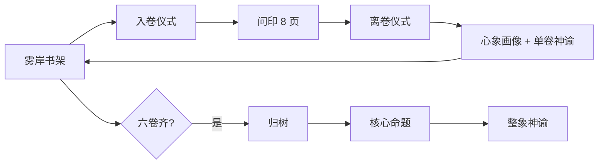

# 雾岸六卷 · 心象生命之树探索

**Mist Shore · Six Books · Tree of Life** · **霧岸六巻 · 心象生命の樹**

---

## 文档导读 · How to Read This Repo

### 现状与问题

原先 README 约 **2000 行**：核心命题、修持全文、界面截图、开发说明与 **五层理论** 混在同一文件；目录出现在第 200 行之后，**产品说明**反而排在 **1500 行理论**之后。读起来像「先读论文，再找怎么跑项目」——逻辑倒置，也不紧凑。

### 重新设计后的三层文档

| 层级 | 文件 | 给谁读 | 内容 |
|------|------|--------|------|
| **产品与修持** | 本 README | 产品、文案、新成员 | 命题 → 体验路径 → **修持引导语全文 + 设计缘由** → 预览 → 开发运维 |
| **理论栈** | [`docs/theory/`](docs/theory/) | 想深入玄学架构者 | 五层长文（I 玄学 → V 形而上），按需打开 |
| **开发约定** | [`.cursor/skills/psyche-tree-demo/SKILL.md`](.cursor/skills/psyche-tree-demo/SKILL.md) | Agent / 工程师 | 六卷结构、API、verify、不可破坏的 UX |

### 建议阅读顺序

1. [核心命题](#二核心命题) → [体验路径](#三体验路径) → [修持环](#四修持环)（含引导语全文）  
2. 要跑起来：[快速开始](#快速开始) → [脚本与 QA](#脚本与-qa)  
3. 要改理论或 prompt：先确认与命题一致，再查 [`docs/theory/`](docs/theory/) 对应层  

### 文案源文件

产品内修持与归树文案的**唯一源文本**（含 en/ja）：[`src/i18n/volumeRite.ts`](src/i18n/volumeRite.ts)。本 README 收录**简体全文**供审阅与对外说明；繁體 UI 由 OpenCC 自简体转换；神谕为 DeepSeek 独立生成并分 locale 缓存。

---

## 目录 · Contents

| # | 章节 | 说明 |
|---|------|------|
| 一 | [这是什么](#一这是什么) | 产品一句话 |
| 二 | [核心命题](#二核心命题) | 统领全体验的哲学锚点 |
| 三 | [体验路径](#三体验路径) | 从书架到整象的阶段 |
| 四 | [修持环](#四修持环) | 流程、缘由、**入卷/离卷/归树引导语全文** |
| 五 | [界面预览](#五界面预览) | 书架四语截图 |
| 六 | [开发与运维](#六开发与运维) | 功能、安装、脚本、结构、UX、语言、部署 |
| 七 | [理论栈导引](#七理论栈导引) | 五层理论索引（长文外置） |

---

## 一、这是什么

**中文**  
网页自我探索 Demo：六卷书（心象 / 映心 / 明思 / 缘书 / 流衡 / 向光）以翻书问答收集六个心理维度与整象封印；背景生命之树随进度展开。每卷产出心象画像与单卷神谕；六卷完成后，书架经**归树**呈现整象神谕。四语：**简体 / 繁體 / English / 日本語**。

**English**  
A flip-book self-exploration demo across six facets, with a Tree of Life background, per-volume portraits and oracles, and a holistic oracle on the shelf after **Return to the Tree**. Four locales.

**日本語**  
六巻のめくる問答と生命の樹、巻別神託、**帰樹**後の整象神託。四言語対応。

---

## 二、核心命题

**主命题**  
人的一生，不是在寻找答案，而是在不断**校准**自己看见世界、感受世界、与世界相处的方式。

**副命题**  
世界未必因你而改变，但你**如何看见**，会不断改变你自己。

| English | 日本語 |
|---------|--------|
| Life calibrates how you see, feel, and meet the world—not a hunt for fixed answers. | 人生は答え探しではなく、見方・感じ方・向き合い方の**校准**の旅。 |
| How you see keeps changing you, even if the world does not change for you. | 世界は変わらなくても、**見方**はあなたを変え続ける。 |

**为何放在最前**  
测评产品默认暗示「作答 → 得分 → 结论」。雾岸刻意把**校准看见方式**写在一切之前：六卷是六面镜子，整象是归树后的开口，不是标准答案库。下文五层理论是**机制语言**；命题才是**价值锚点**。

---

## 三、体验路径



| 阶段 | 用户所见 | 说明 |
|------|----------|------|
| 书架 | 六卷、语言切换 | 邮箱留印；完成后出现整象入口 |
| 入卷 | 全屏修持 overlay | 本卷专属引导，见 [§四](#四修持环) |
| 问印 | 6 维度 + 注意力 + 整象封印 | 一页一卡，~420ms 自动翻页；无分数 |
| 离卷 | 合卷前的短仪式 | 心象卷可写一句反思 |
| 单卷结果 | 画像 → 神谕 → 合书 | 提示回书架；**整象不在此出现** |
| 归树 → 整象 | 书架 overlay | 每 journey 首次开整象前必过；非「总结报告」 |

视觉：深黑 `#0a0a0a`、黑白意象卡、淡金点缀；各语言独立 mystic 字体。

---

## 四、修持环

### 4.1 流程与设计缘由

**流程**  
每卷：**入卷 → 问印 → 离卷**；六卷任意顺序完成；齐后 **归树 → 核心命题 → 整象神谕**。

**为何要有修持环，而不直接答题**

| 问题 | 若不设仪式 | 入卷/离卷/归树的作用 |
|------|------------|----------------------|
| 测评心态 | 用户带「做完题看结果」的焦虑进入 | 入卷先**降速、定场**，把「看见」置于「作答」之前 |
| 六卷同质感 | 六本书像六份问卷 | 每卷入卷用**不同意象**（湖/河/夜空/丝线/船/光）锚定该卷测向 |
| 结果冲击 | 答完立刻看分析 | 离卷**缓冲**，心象卷另设一句反思，避免「被判定」感 |
| 整象像总结 | 六份报告拼接 | 归树强调**树未变、观者变**——整象是镜面的开口，不是 PPT 汇总 |

**六卷一览**

| 卷 | 测向 | 入卷意象 | 离卷要点 | 设计缘由（一句） |
|----|------|----------|----------|------------------|
| 心象 | 自我 | 三分钟静坐 · 无风湖面 | 写一句「今天第一次看见了什么」 | 自我卷最易「分析自己」；先入定再允许沉默 |
| 映心 | 情感 | 不控制，只流动 · 落叶顺河 | 不必命名流过的一切 | 对抗「管理情绪」惯性，先赋流动权 |
| 明思 | 思维 | 减噪 · 夜空北极星 | 让最后一念自行熄灭 | 思维卷易答题成瘾；先减噪再问印 |
| 缘书 | 关系 | 靠近时心的变化 · 丝线 | 再看丝线，不断不拉 | 关系题易滑向「别人怎么看我」 |
| 流衡 | 节奏 | 力量流向 · 船心 | 感船心仍在中流 | 区分「更努力」与「流向哪里」 |
| 向光 | 方向 | 今天一小步 · 远方微光 | 确认今天的一步已迈出 | 把方向从「遥远未来」收到「今日一步」 |

实现：`VolumeRiteOverlay` · `ReturnToTreeOverlay` · [`volumeRite.ts`](src/i18n/volumeRite.ts)。

---

### 4.2 引导语全文（简体）

以下为产品内与用户所见一致的文案。**English / 日本語** 见 `volumeRite.ts`。

#### 第一卷 · 心象 · 照见自我

**入卷仪式**  
阅读前，请安静坐三分钟。  
不要回忆今天发生了什么。  
不要计划接下来要做什么。  
只需要观察：此刻，我在哪里？  
不是身体在哪里。  
而是：我的心，此刻停留在哪里？

**观照方式**  
阅读时，不要急着回答。  
如果一个问题让你沉默，请允许沉默。  
因为：沉默，本身就是一种回答。

**冥想方式**  
闭上眼睛。  
想像自己站在一片湖边。  
湖面没有风。  
不要刻意寻找倒影。  
只是等待。  
直到湖面慢慢出现你的影子。  
如果影子模糊，不用调整。  
因为：湖不会骗人。  
真正需要安静的，不是湖，而是观看的人。

**离卷**  
完成后，不要马上查看分析。  
请写下一句话：*今天，我第一次真正看见了什么？*（可选输入）

---

#### 第二卷 · 映心 · 照见情感

**不控制，只流动**  
这里不建议「控制情绪」。  
而是：让情绪拥有流动的权利。

**冥想**  
想像自己站在一条河边。  
每一种情绪，都是一片叶子。  
不要捡起来。不要追赶。  
让它顺流而去。  
直到河面重新平静。  
然后问自己：还有什么，没有流走？

**离卷**  
合卷前，请再静息片刻。  
不必命名刚才流过的一切——让湖仍留在湖上。

---

#### 第三卷 · 明思 · 照见思维

**观照**  
思考，不是不断增加答案。  
而是不断减少噪音。

**冥想**  
想像夜空。  
每一个念头，都是一颗星。  
不要数。不要命名。  
直到：整片天空，开始出现真正的北极星。

**离卷**  
合卷前，请让最后一个念头自行熄灭，再进入照见。

---

#### 第四卷 · 缘书 · 照见关系

**观照**  
不要想：别人怎么看你。  
而是：当别人靠近时，你的心，发生了什么？

**仪式**  
想像自己手中有一根丝线。  
另一端，连接着重要的人。  
不要拉近。也不要剪断。  
只是观察：它现在是什么颜色？有没有重量？有没有温度？

**离卷**  
合卷前，请再看一眼手中的丝线——不断，不拉，只是知道它还在。

---

#### 第五卷 · 流衡 · 照见节奏

**观照**  
人生真正的问题，不是努力。  
而是：力量流向哪里。

**冥想**  
想像自己是一条船。  
不是暴风雨。也不是大海。  
而是船。  
风不会停止。浪不会停止。  
真正需要稳定的，只有船心。

**离卷**  
合卷前，请感船心仍在中流——不必靠岸，只需知所。

---

#### 第六卷 · 向光 · 照见方向

**观照**  
不要问：未来在哪里。  
而是：今天这一小步，是不是朝向真正重要的地方。

**冥想**  
想像远方有一点微光。  
不用走过去。  
只需要：今天，朝它走一步。就够了。

**离卷**  
合卷前，请确认：今天的那一步，已经迈出。

---

#### 归树 · Return to the Tree（六卷完成后）

**归树仪式**  
闭上眼。  
想像自己重新站在那棵树前。  
第一次来到这里时，树没有改变。  
今天再次回来，树依然没有改变。  
改变的是：你开始能够看见，以前没有看见的枝叶。

**照见**  
于是你会明白：  
树从来不是答案。  
树只是照见你的镜子。  
成长的，不是树——是观看树的人。

**核心命题（归树中段呈现）**  
- 主：人的一生，不是在寻找答案，而是在不断校准自己看见世界、感受世界、与世界相处的方式。  
- 副：世界未必因你而改变，但你看见世界的方式，会不断改变你自己。

**归树收束**  
六向已齐。整象神谕在雾中等待——不是总结，而是归树之后，整片树影的一次开口。

**为何归树在整象之前**  
六卷各照一面，易碎成六块「结论」。归树把体验收束回**同一棵树、同一命题**，再开整象——用户带着「观者变了」的状态读神谕，而非带着「六份报告待汇总」的心态。

---

## 五、界面预览

书架首页四语截图：[`docs/screenshots/homepage/`](docs/screenshots/homepage/)（`node scripts/capture-homepage-screenshots.mjs` 可重生成）。

| 语言 | 截图 | 主标题 |
|------|------|--------|
| 简体 |  | 雾岸书架 |
| 繁體 |  | 霧岸書架 |
| English |  | Mist Shelf |
| 日本語 |  | 霧岸の書架 |

繁體 UI：OpenCC 自简体；正文 **Noto Serif TC**；玄学标题 **Zhi Mang Xing**。

---

## 六、开发与运维

### 功能要点

| 能力 | 说明 |
|------|------|
| 六卷独立 | 完成顺序不影响 journey；六卷齐 → `completed` |
| 修持环 | 入卷 / 离卷 / 归树 → 整象（见 §四） |
| 持久化 | SQLite + 邮箱 journey；四语神谕分列缓存 |
| 神谕 | DeepSeek 单卷 + 整象；失败本地 fallback |
| QA | `PSYCHE_READING_TEST_FALLBACK=1` 或请求头 `X-Psyche-Reading-Test-Fallback: 1` |
| 整象 prompt | 六卷底层画像 + 各卷已示神谕 |
| BGM | Mixkit 三场景淡入（书架 / 问印 / 结果） |

### 快速开始

```bash
git clone git@github.com:huter927419-sys/psyche-tree-demo.git
cd psyche-tree-demo
npm install
cp .env.example .env.local   # DEEPSEEK_API_KEY
npm run dev                  # http://localhost:5173
```

```env
DEEPSEEK_API_KEY=your_api_key_here
DEEPSEEK_MODEL=deepseek-v4-pro
SQLITE_PATH=./data/psyche-tree.sqlite
PSYCHE_READING_TEST_FALLBACK=0   # 1 = QA 即时神谕，勿用于生产
```

API Key 仅 Vite 中间件使用，不打进前端包。

### 脚本与 QA

| 命令 | 用途 |
|------|------|
| `node scripts/verify-full-flow.mjs` | API 全流程 39 项；默认 test-fallback 头；202 自动 poll |
| `node scripts/verify-rite-flow.mjs` | Playwright：修持环 + 归树 UI（需 Chrome） |
| `node scripts/complete-user-journey.mjs [email]` | 补全六卷 + 多用户隔离 |
| `node scripts/test-locale-switch.mjs` | 四语神谕缓存 |
| `node scripts/reset-db.mjs` | 清空 SQLite |

### 项目结构

```
psyche-tree-demo/
├── README.md                          # 本文件：产品 + 修持全文
├── docs/theory/                       # 五层理论长文
├── docs/screenshots/homepage/         # 书架四语截图
├── .cursor/skills/psyche-tree-demo/   # Agent：SKILL + reference
├── src/i18n/volumeRite.ts             # 修持 / 归树 / 命题文案源
├── src/components/book/VolumeRiteOverlay.tsx
├── src/components/bookshelf/ReturnToTreeOverlay.tsx
├── server/readingTestFallback.ts      # QA 神谕加速
└── scripts/verify-*.mjs
```

### 交互约定

1. 一页一卡，~420ms 自动翻页；结果页无分数  
2. 整象**仅**在书架；单卷结果页不出现  
3. 树进度只计维度 1–6  
4. 切换语言读缓存，不重新计分  
5. 每卷：入卷 → 问印 → 离卷；六卷齐后书架先归树再整象  

### 语言与数据库

| Locale | 标签 | 神谕列（单卷 / 整象） |
|--------|------|------------------------|
| `zh` | 简体 | `mystical_reading_zh` / `holistic_reading_zh` |
| `zhTw` | 繁體 | `mystical_reading_zh_tw` / `holistic_reading_zh_tw`（UI OpenCC；神谕独立繁体生成） |
| `en` | English | `*_en` |
| `ja` | 日本語 | `*_ja` |

### 部署

`npm run build` → 静态 `dist/` + 需 Node 托管 API 中间件（或等价后端接 SQLite 与 DeepSeek）。生产环境**勿**开启 `PSYCHE_READING_TEST_FALLBACK`。

### 技术栈

React 19 · Vite 8 · TypeScript · Tailwind CSS 4 · SQLite（`better-sqlite3`）· DeepSeek API · Playwright（verify）

---

## 七、理论栈导引

完整长文已移至 [`docs/theory/`](docs/theory/)，避免与本 README 的产品说明抢篇幅。

| 层 | 文档 | 一句话 |
|----|------|--------|
| I 玄学体系 | [01-mystical-framework.md](docs/theory/01-mystical-framework.md) | 世界观、场域·能量·心流、冥想祈祷反思、双层神示 |
| II 简明理论 | [02-concise-theory.md](docs/theory/02-concise-theory.md) | 六维状态结构 + 整象封印 |
| III 进阶泛化 | [03-advanced-generalization.md](docs/theory/03-advanced-generalization.md) | State · Force · Field 通用建模 |
| IV 增强理论 | [04-enhanced-theory.md](docs/theory/04-enhanced-theory.md) | Flow · Awareness · Field 统一 |
| V 形而上扩展 | [05-metaphysical-extension.md](docs/theory/05-metaphysical-extension.md) | Stream · Origin · Causality |

问印前的 **theory layer**（`books/shared/theoryLayer.ts`）是 II–IV 层的题面化前缀；答案卡仍为心理学表述。开发细节：[SKILL.md](.cursor/skills/psyche-tree-demo/SKILL.md) · [reference.md](.cursor/skills/psyche-tree-demo/reference.md)。

---

*雾岸六卷 — 校准看见，而非索取标准答案。*
