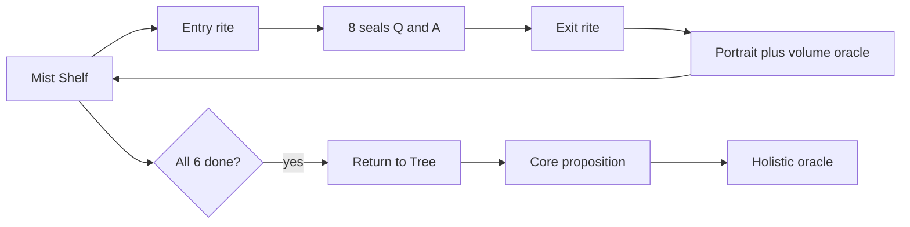

# 雾岸六卷 · 心象生命之树探索

**Mist Shore · Six Books · Tree of Life** · **霧岸六巻 · 心象生命の樹**

> **文档语言约定 · Documentation languages · ドキュメント言語**  
> 本项目说明文档默认 **简体 · English · 日本語** 并列呈现，不省略（流程图等 ASCII 受限处除外，见各节说明）。  
> Product docs present **Simplified Chinese, English, and Japanese** side by side unless noted.  
> 製品ドキュメントは原則として**簡体字·英語·日本語**を併記する。

---

## 文档导读 · How to Read This Repo · ドキュメントの読み方

### 三层文档 · Three layers · 三層構成

| 层级 Layer | 文件 File | 给谁 For whom | 内容 Content |
|------------|-----------|---------------|--------------|
| **产品与修持** Product & rites | 本 README · this file | 产品、文案、新成员 · PM, copy, newcomers | 命题 → 体验路径 → [修持三语全文](docs/volume-rite-copy.md) → 预览 → 开发 |
| **理论栈** Theory stack | [`docs/theory/`](docs/theory/) | 深入玄学架构者 · deep theory readers | 五层长文 I→V · five layers |
| **开发约定** Dev conventions | [SKILL.md](.cursor/skills/psyche-tree-demo/SKILL.md) | Agent / 工程师 · engineers | 六卷结构、API、verify、UX 红线 |

### 建议阅读顺序 · Reading order · 推奨順

1. [核心命题](#二核心命题--core-proposition--核心命題) → [体验路径](#三体验路径--experience-path--体験の流れ) → [修持环](#四修持环--volume-rite-cycle--修持環) → [修持三语全文](docs/volume-rite-copy.md)  
2. 要跑起来 Run locally：[快速开始](#快速开始--quick-start--クイックスタート) → [脚本与 QA](#脚本与-qa--scripts--スクリプト)  
3. 改理论 / prompt：先对齐命题，再查 [`docs/theory/`](docs/theory/)  

### 文案源文件 · Copy source · 文案ソース

| 简体 zh | English | 日本語 |
|---------|---------|--------|
| 产品内修持与归树文案源：`src/i18n/volumeRite.ts` | Same source for in-app rites | 製品内儀式文案のソースも同ファイル |
| 文档三语全文：`docs/volume-rite-copy.md`（`npx tsx scripts/generate-rite-docs.ts` 可重生） | Regenerate with `generate-rite-docs.ts` | ドキュメント三語全文は同 MD |
| 繁體 UI：OpenCC 自简体；神谕：DeepSeek 分 locale 缓存 | zhTw UI via OpenCC; oracles cached per locale | 繁體 UI は OpenCC、神託は locale 別キャッシュ |

---

## 目录 · Contents · 目次

| # | 章节 Section | 简体 | English | 日本語 |
|---|--------------|------|---------|--------|
| 一 | [这是什么](#一这是什么--what-is-this--これは何か) | 产品概览 | Overview | 概要 |
| 二 | [核心命题](#二核心命题--core-proposition--核心命題) | 哲学锚点 | Core proposition | 核心命題 |
| 三 | [体验路径](#三体验路径--experience-path--体験の流れ) | 书架→整象 | Shelf → holistic | 体験の流れ |
| 四 | [修持环](#四修持环--volume-rite-cycle--修持環) | 流程与缘由 | Rite cycle | 修持環 |
| — | [修持三语全文](docs/volume-rite-copy.md) | 入卷/离卷/归树 | Full rite copy | 導き三語全文 |
| 五 | [界面预览](#五界面预览--ui-preview--画面プレビュー) | 四语截图 | UI preview | 画面 |
| 六 | [开发与运维](#六开发与运维--dev--ops--開発運用) | 安装/脚本 | Dev & ops | 開発・運用 |
| 七 | [理论栈导引](#七理论栈导引--theory-index--理論索引) | 五层索引 | Theory index | 理論索引 |

---

## 一、这是什么 · What is this · これは何か

**中文**  
网页自我探索 Demo：六卷书（心象 / 映心 / 明思 / 缘书 / 流衡 / 向光）以翻书问答收集六个心理维度与整象封印；背景生命之树随进度展开。每卷产出心象画像与单卷神谕；六卷完成后，书架经**归树**呈现整象神谕。四语：**简体 / 繁體 / English / 日本語**。

**English**  
A flip-book self-exploration demo across six facets, with a Tree of Life background, per-volume portraits and oracles, and a holistic oracle on the shelf after **Return to the Tree**. Four locales.

**日本語**  
六巻のめくる問答と生命の樹、巻別神託、**帰樹**後の整象神託。四言語対応。

---

## 二、核心命题 · Core Proposition · 核心命題

| | 简体 | English | 日本語 |
|---|------|---------|--------|
| **主** Main | 人的一生，不是在寻找答案，而是在不断**校准**自己看见世界、感受世界、与世界相处的方式。 | A life is not a search for answers, but a continual **calibration** of how you see, feel, and meet the world. | 人生は答えを探す旅ではなく、世界の見方・感じ方・向き合い方を**調え続ける**旅である。 |
| **副** Sub | 世界未必因你而改变，但你**如何看见**，会不断改变你自己。 | The world may not change because of you—but **how you see** keeps changing you. | 世界はあなたのために変わらなくても、**見方**はあなた自身を変え続ける。 |

| 简体 | English | 日本語 |
|------|---------|--------|
| 测评默认暗示「作答→得分→结论」；雾岸把**校准看见**置于一切之前。六卷是六面镜，整象是归树后的开口，不是标准答案库。 | Assessments imply scores and verdicts; Mist Shore anchors on **calibrating sight**—six mirrors, then the oracle after Return to the Tree. | 診断は点数と結論を暗示しがち；霧岸は**見方の校准**を先に置く。六巻は鏡、整象は帰樹後の開口。 |
| 下文五层理论为**机制语言**；本命题为**价值锚点**。 | Five theory layers are **mechanism language**; this proposition is the **value anchor**. | 下記五層理論は**机制**、本命題は**価値の錨**。 |

---

## 三、体验路径 · Experience path · 体験の流れ

> **关于流程图文字**  
> Mermaid 在多数 Markdown 预览（含 Cursor / GitHub）中对**中文节点**支持差，会显示为乱码方框。下图节点因此使用 **English** 以保证可读；逐步对照见下表 **简体 · English · 日本語**，不省略。



| 阶段 · Stage · 段階 | 简体 | English | 日本語 | 说明 |
|---------------------|------|---------|--------|------|
| A 书架 | 雾岸书架 | Mist Shelf | 霧岸の書棚 | 六卷、四语切换；邮箱留印；六卷完成后出现整象入口 |
| B 入卷 | 入卷仪式 | Entry rite | 入巻の儀 | 全屏修持 overlay；本卷引导语见 [§四](#四修持环--volume-rite-cycle--修持環) |
| C 问印 | 问印 8 页 | 8 seals (Q&A) | 問印 8 ページ | 6 维度 + 注意力 + 整象封印；一页一卡，~420ms 自动翻页；无分数 |
| D 离卷 | 离卷仪式 | Exit rite | 離巻の儀 | 合卷前短仪式；心象卷可写一句反思 |
| E 单卷结果 | 心象画像 + 单卷神谕 | Portrait + volume oracle | 心象 + 巻別神託 | 画像 → 神谕 → 合书 → 回书架；**整象不在此出现** |
| F 判断 | 六卷齐？ | All six complete? | 六巻完了？ | 顺序无关；六卷 assessment 齐则 journey `completed` |
| G 归树 | 归树 | Return to the Tree | 帰樹 | 每 journey 首次开整象前必过；树未变、观者变 |
| H 命题 | 核心命题 | Core proposition | 核心命題 | 归树中段呈现主/副命题 |
| I 整象 | 整象神谕 | Holistic oracle | 整象神託 | 书架 overlay；非六卷报告汇总 · shelf overlay; not a report rollup · 書棚；報告の要約ではない |

| 简体 | English | 日本語 |
|------|---------|--------|
| 视觉：深黑 `#0a0a0a`、黑白意象卡、淡金点缀；各语言独立 mystic 字体。 | Visual: deep black, monochrome cards, soft gold; locale-specific mystic type. | ビジュアル：深黒、白黒カード、淡い金；言語別 mystic 書体。 |

---

## 四、修持环 · Volume rite cycle · 修持環

### 4.1 流程与设计缘由 · Flow & rationale · 流程と意図

| 简体 | English | 日本語 |
|------|---------|--------|
| 每卷：**入卷 → 问印 → 离卷**；六卷任意顺序；齐后 **归树 → 核心命题 → 整象神谕**。 | Per volume: **entry → seals → exit**; any order; then **Return to Tree → proposition → holistic oracle**. | 各巻：**入巻→問印→離巻**；順不同可；六巻後 **帰樹→命題→整象神託**。 |

**为何要有修持环 · Why rites · なぜ儀式か**

| 问题 Issue | 简体 | English | 日本語 |
|------------|------|---------|--------|
| 测评心态 | 入卷**降速定场**，「看见」先于「作答」 | Entry slows pace; **seeing** before **answering** | 入巻で**降速**、「見る」を先に |
| 六卷同质 | 湖/河/夜空/丝线/船/光 锚定测向 | Lake, river, sky, thread, boat, light imagery | 各巻で異なる意象 |
| 结果冲击 | 离卷缓冲；心象卷可写反思 | Exit buffers before results; journal on vol. I | 離巻で缓冲 |
| 整象像总结 | 归树：树未变、观者变 | Return to Tree: tree unchanged, viewer changed | 帰樹：樹は同じ、見る者が変わる |

**六卷一览 · Six volumes · 六巻一覧**

| 卷 | 简体 | English | 日本語 |
|----|------|---------|--------|
| 心象 | 自我；湖影；写「今天看见了什么」 | Self; still lake; one-line reflection | 自我；湖；一言の反照 |
| 映心 | 情感；落叶顺河；不必命名 | Feeling; leaves on river; don't name all | 感情；葉と川 |
| 明思 | 思维；夜空北极星；念自熄 | Thought; North Star; last thought fades | 思考；北極星 |
| 缘书 | 关系；丝线；不断不拉 | Bond; thread; neither cut nor pull | 関係；糸 |
| 流衡 | 节奏；船心；知所 | Rhythm; boat-heart; know your place | リズム；舟の心 |
| 向光 | 方向；远方微光；今日一步 | Direction; distant light; one step today | 方向；一歩 |

实现 Implementation：`VolumeRiteOverlay` · `ReturnToTreeOverlay` · [`volumeRite.ts`](src/i18n/volumeRite.ts)

---

### 4.2 引导语三语全文 · Full rite copy (zh / en / ja) · 導き三語全文

**简体 · English · 日本語** 并列全文见 **[`docs/volume-rite-copy.md`](docs/volume-rite-copy.md)**（与产品同源；更新后运行 `npx tsx scripts/generate-rite-docs.ts` 重生）。

示例（心象 · 入卷首段）：

> **简体** — 阅读前，请安静坐三分钟。不要回忆今天发生了什么。……  
> **English** — Before reading, sit quietly for three minutes. Do not replay what happened today.……  
> **日本語** — 読む前に、三分間静かに座れ。今日起きたことを振り返るな。……

**归树缘由 · Why Return to Tree before holistic · 帰樹の意図**

| 简体 | English | 日本語 |
|------|---------|--------|
| 六卷易碎成六块「结论」；归树收束回同一棵树与命题，再开整象。 | Six facets risk six fragments; Return to Tree reunifies before the oracle. | 六面が六つの「結論」に割れがち；帰樹で一本の樹へ。 |

---

## 五、界面预览 · UI Preview · 画面プレビュー

| 简体 | English | 日本語 |
|------|---------|--------|
| 书架四语截图见 [`docs/screenshots/homepage/`](docs/screenshots/homepage/) | Homepage shots for zh / zhTw / en / ja | 書棚四言語スクリーンショット |
| 重生：`node scripts/capture-homepage-screenshots.mjs`（需 dev） | Regenerate while dev server runs | dev 起動中に再生成 |

| Locale | 截图 Shot | 主标题 Title |
|--------|-----------|--------------|
| 简体 zh |  | 雾岸书架 · Mist Shelf · 霧岸の書棚 |
| 繁體 zhTw |  | 霧岸書架 |
| English |  | Mist Shelf |
| 日本語 ja |  | 霧岸の書架 |

| 简体 | English | 日本語 |
|------|---------|--------|
| 繁體 UI：OpenCC 自简体；正文 Noto Serif TC；标题 Zhi Mang Xing | zhTw via OpenCC; Noto Serif TC body | 繁體は OpenCC；Noto Serif TC |

---

## 六、开发与运维 · Dev & Ops · 開発・運用

### 功能要点 · Features · 主な機能

| 简体 | English | 日本語 |
|------|---------|--------|
| 六卷独立，顺序不影响 journey | Six volumes; order-independent | 六巻独立、順不同可 |
| 修持环：入卷/离卷/归树→整象 | Entry / exit / Return to Tree → holistic | 修持環→整象 |
| SQLite + 邮箱；四语神谕缓存 | SQLite + email; quadrilingual oracle cache | SQLite・四語キャッシュ |
| DeepSeek 神谕；失败 fallback | DeepSeek oracles; local fallback | DeepSeek・fallback |
| QA：`PSYCHE_READING_TEST_FALLBACK` | QA test-fallback env/header | QA 用 fallback |

### 项目结构 · Structure · 構成

```
psyche-tree-demo/
├── README.md                    # 产品说明（三语并列）· product docs (trilingual)
├── docs/volume-rite-copy.md     # 修持三语全文 · full rite copy zh/en/ja
├── docs/theory/                 # 五层理论 · five theory layers
├── docs/screenshots/homepage/   # 书架截图 · shelf screenshots
├── .cursor/skills/…/SKILL.md    # Agent 开发约定 · dev skill
└── src/i18n/volumeRite.ts       # 修持文案源 · rite copy source
```

### 快速开始 · Quick start · クイックスタート

```bash
git clone git@github.com:huter927419-sys/psyche-tree-demo.git
cd psyche-tree-demo
npm install
cp .env.example .env.local   # DEEPSEEK_API_KEY
npm run dev                  # http://localhost:5173
```

```env
DEEPSEEK_API_KEY=your_api_key_here
DEEPSEEK_MODEL=deepseek-v4-pro
SQLITE_PATH=./data/psyche-tree.sqlite
PSYCHE_READING_TEST_FALLBACK=0   # 1 = QA 即时神谕，勿用于生产
```

| 简体 | English | 日本語 |
|------|---------|--------|
| API Key 仅 Vite 中间件使用，不打进前端包 | Keys stay on dev middleware only | キーはミドルウェアのみ |

### 脚本与 QA · Scripts · スクリプト

| 命令 | 简体 | English | 日本語 |
|------|------|---------|--------|
| `verify-full-flow.mjs` | API 39 项 + test-fallback | Full API smoke test | API 一連テスト |
| `verify-rite-flow.mjs` | Playwright 修持环 UI | Rite cycle UI (Chrome) | 修持環 UI |
| `generate:rite-docs` / `generate-rite-docs.ts` | 重生三语修持 MD | Regenerate rite doc | 三語 MD 再生成 |
| `complete-user-journey.mjs` | 补全六卷 | Fill six books | 六巻完了 |
| `test-locale-switch.mjs` | 四语神谕缓存 | Oracle cache test | キャッシュ検証 |
| `reset-db.mjs` | 清空 SQLite | Reset DB | DB リセット |

### 交互约定 · UX · インタラクション

| # | 简体 | English | 日本語 |
|---|------|---------|--------|
| 1 | 一页一卡 ~420ms；无分数 | One card/page; no scores | 1枚/ページ；点数なし |
| 2 | 整象仅书架 | Holistic oracle shelf-only | 整象は書棚のみ |
| 3 | 树进度计维度 1–6 | Tree counts dims 1–6 | 樹は 1–6 のみ |
| 4 | 换语言读缓存 | Locale switch uses cache | 言語切替はキャッシュ |
| 5 | 入卷→问印→离卷；归树后整象 | Entry→seals→exit; 归树 then oracle | 入巻→問印→離巻；帰樹後整象 |

### 语言与数据库 · Locales · 言語と DB

| Code | 简体 | English label | 日本語 | 神谕列 Oracle cols |
|------|------|---------------|--------|---------------------|
| `zh` | 简体 | Simplified Chinese | 簡体字 | `*_zh` / `holistic_reading_zh` |
| `zhTw` | 繁體 OpenCC UI；神谕独立繁体 | Traditional UI; separate oracle | 繁體 UI；神託別生成 | `*_zh_tw` |
| `en` | 英文 | English | 英語 | `*_en` |
| `ja` | 日文 | Japanese | 日本語 | `*_ja` |

### 部署 · Deployment · デプロイ

| 简体 | English | 日本語 |
|------|---------|--------|
| `npm run build` → `dist/` + Node API；生产勿开 test-fallback | Static dist + Node middleware; no test-fallback in prod | 本番で test-fallback 禁止 |

### 技术栈 · Stack · 技術スタック

React 19 · Vite 8 · TypeScript · Tailwind CSS 4 · SQLite · DeepSeek · Playwright

---

## 七、理论栈导引 · Theory index · 理論索引

| 层 | 文档 | 简体 | English | 日本語 |
|----|------|------|---------|--------|
| I | [01-mystical-framework.md](docs/theory/01-mystical-framework.md) | 如何进入照见 | How to enter mirroring | どう入るか |
| II | [02-concise-theory.md](docs/theory/02-concise-theory.md) | 六维状态结构 | Six-dimension state | 六次元構造 |
| III | [03-advanced-generalization.md](docs/theory/03-advanced-generalization.md) | State·Force·Field | General modeling | 汎化層 |
| IV | [04-enhanced-theory.md](docs/theory/04-enhanced-theory.md) | Flow·Awareness·Field | Enhanced dynamics | 拡張理論 |
| V | [05-metaphysical-extension.md](docs/theory/05-metaphysical-extension.md) | 意识与因果 | Consciousness & causality | 形而上拡張 |

| 简体 | English | 日本語 |
|------|---------|--------|
| 问印 theory layer（`theoryLayer.ts`）为 II–IV 题面化；答案卡仍为心理学表述 | Question theory layer instantiates layers II–IV | 問印 theory layer は II–IV の題面化 |
| 开发细节：[SKILL.md](.cursor/skills/psyche-tree-demo/SKILL.md) · [reference.md](.cursor/skills/psyche-tree-demo/reference.md) | Dev: SKILL + reference | 開発：SKILL + reference |

---

| 简体 | English | 日本語 |
|------|---------|--------|
| *雾岸六卷 — 校准看见，而非索取标准答案。* | *Mist Shore Six Books — calibrate seeing, not hunt fixed answers.* | *霧岸六巻 — 見方を調えよ。答えを探すな。* |
